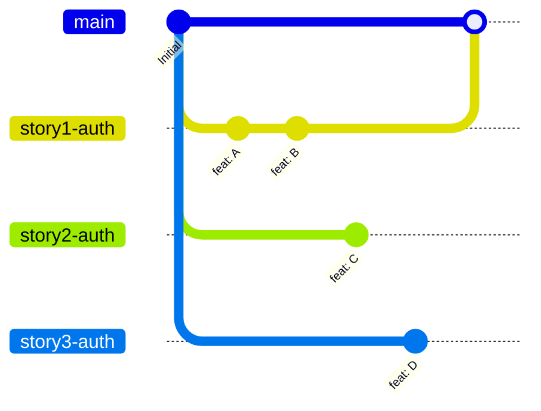
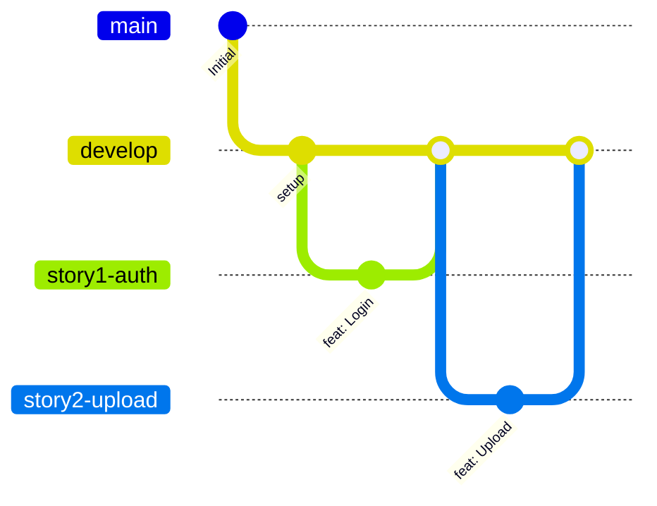
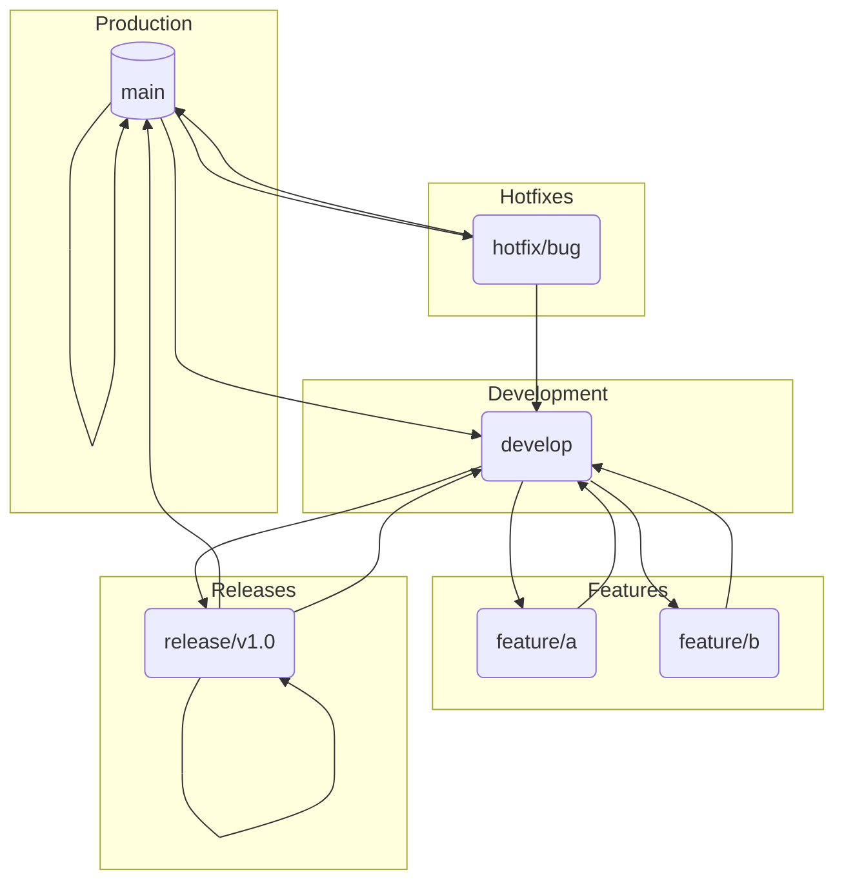
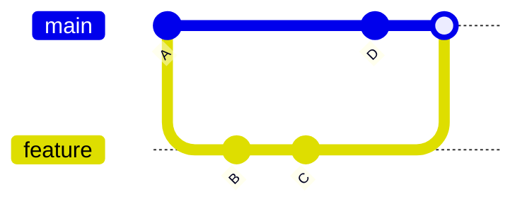
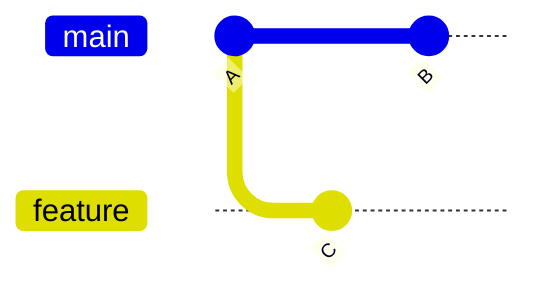
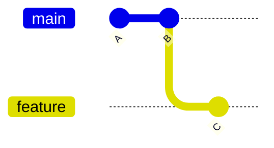
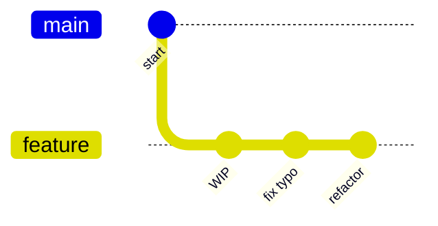
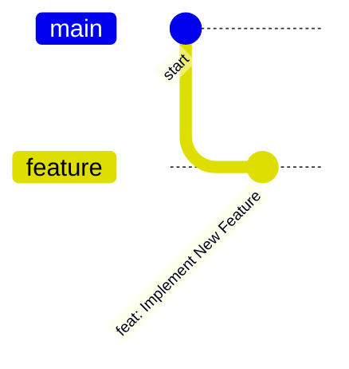

# Git Branching Best Practices 🌳

This document outlines best practices for using Git, focusing on a robust branching strategy. Adhering to these guidelines will help you maintain a clean project history, streamline collaboration, and significantly reduce the complexities of merging code.

-----

## The Problem with Premature Branching

Creating all your feature branches (`story1-auth`, `story2-auth`, etc.) from the main branch at the very beginning might seem like good organization. However, this approach inevitably leads to significant problems, a situation often called **"merge hell."**

When you create all branches from the same point, they don't know about each other's changes. As you complete and merge them one by one, you have to constantly update all the other waiting branches with the new changes from `main`.

### How It Goes Wrong

1.  All `story` branches are created from the same commit on `main`.
2.  You finish `story1-auth` and merge it. `main` now has new code.
3.  `story2-auth`, `story3-auth`, and all other branches are now **outdated**. They don't have the code from `story1-auth`.
4.  Before working on `story2-auth`, you **must** merge the new `main` into it.
5.  When you finish `story2-auth` and merge it, `main` is updated again.
6.  Now, `story3-auth`, `story4-upload`, etc., are even more outdated. You have to merge `main` into them to get them up to date.

This creates a cycle of repetitive, complex merges with a high risk of conflicts.

-----

## The "One Branch, One Story" Principle

A much more effective best practice is: **one feature branch per story, created just in time.** This is a core concept of modern development workflows.

### The Correct Workflow

1.  Pull the latest changes to your main development branch (we'll call it `develop`).
2.  Create a **new branch** for the *single* story you are about to work on.
3.  Do all your work for that story on this dedicated branch.
4.  When the story is complete, create a **Pull Request** (PR) to merge your story branch back into `develop`.
5.  After the PR is reviewed and merged, the branch is deleted.
6.  **Repeat**: To start the next story, pull the latest `develop` and create a *new* branch.

This ensures each feature is built on the most up-to-date version of the codebase, dramatically simplifying merges.

-----

## In-Depth: Branching Models & Commands

### The Git Flow Model

**Git Flow** is a popular branching model that provides a robust framework for managing projects. It defines specific roles for different branches and how they should interact.

  * **`main`**: Always production-ready and stable. Never commit directly to it.
  * **`develop`**: The primary development branch. All feature branches stem from here and are merged back here.
  * **`feature/*`**: Branched from `develop` for new stories.
  * **`release/*`**: Branched from `develop` to prepare for a new production release (final tests, bug fixes).
  * **`hotfix/*`**: Branched from `main` to quickly fix critical production bugs.

-----

### `git merge`

This command integrates changes from one branch into another. It creates a new **"merge commit"** that ties the two branch histories together, preserving the history of every commit.

**When to use it:** The standard way to merge completed features into your `develop` or `main` branch.

-----

### `git rebase`

Rebasing rewrites history by taking your commits and placing them on top of the commits from another branch. This results in a **linear and cleaner** history.

**Before rebase:**

**After 'git rebase main' on 'feature' branch:**

**When to use it:** Use it to update your feature branch with the latest changes from `develop` *before* creating a pull request.

⚠️ **Golden Rule of Rebasing:** **NEVER** rebase a branch that has been pushed and is being used by others. Rewriting shared history will cause major problems for your teammates.

-----

### `git squash`

Squashing combines multiple commits into a single, comprehensive commit. It's usually done with an **interactive rebase** (`git rebase -i`). This is perfect for cleaning up small, messy commits ("fix typo," "oops") into one meaningful commit before merging.

**Before Squashing:**

**After Squashing the last 3 commits:**

**When to use it:** To make your feature's history clean and concise before opening a pull request. This keeps the `develop` and `main` branch history easy to read and understand. 