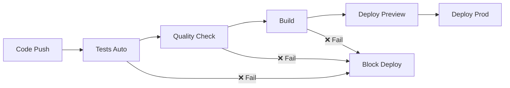

# 🚀 Tutoriel CI/CD avec Vercel & GitHub Actions

## 📚 Table des Matières
1. [Introduction au CI/CD](#introduction)
2. [Configuration Vercel](#vercel)
3. [GitHub Actions](#github-actions)
4. [Pipeline de Qualité](#qualite)
5. [Déploiement Automatisé](#deploiement)
6. [Monitoring & Rollback](#monitoring)
7. [Exercices Pratiques](#exercices)

---

## 🎯 Introduction au CI/CD {#introduction}

### Qu'est-ce que CI/CD ?

**CI (Continuous Integration)** :
- 🔄 Intégration continue du code
- 🧪 Tests automatiques à chaque commit
- 🔍 Vérification de la qualité du code
- 🚨 Détection précoce des erreurs

**CD (Continuous Deployment)** :
- 🚀 Déploiement automatique
- 🌊 Livraisons fréquentes et fiables
- 📦 Environnements cohérents
- ⚡ Time-to-market réduit

### Pourquoi CI/CD pour CV Genius ?



**Avantages :**
- ✅ **Qualité** : Aucun code cassé en production
- ✅ **Rapidité** : Déploiements en quelques minutes
- ✅ **Confiance** : Tests automatiques à chaque change
- ✅ **Rollback** : Retour arrière immédiat si problème

---

## ⚡ Configuration Vercel {#vercel}

### 1. Configuration Actuelle

Votre `vercel.json` actuel :
```json
{
  "buildCommand": "npm run build",
  "framework": "nextjs",
  "installCommand": "npm install",
  "env": {
    "NEXT_PUBLIC_SUPABASE_URL": "@supabase_url",
    "NEXT_PUBLIC_SUPABASE_ANON_KEY": "@supabase_anon_key",
    "GEMINI_API_KEY": "@gemini_api_key",
    "NEXTAUTH_SECRET": "@nextauth_secret"
  }
}
```

### 2. Configuration Avancée

**Configuration optimisée pour CV Genius :**

```json
{
  "version": 2,
  "buildCommand": "npm run build",
  "framework": "nextjs",
  "installCommand": "npm ci",
  "outputDirectory": ".next",
  "env": {
    "NEXT_PUBLIC_SUPABASE_URL": "@supabase_url",
    "NEXT_PUBLIC_SUPABASE_ANON_KEY": "@supabase_anon_key", 
    "GEMINI_API_KEY": "@gemini_api_key",
    "NEXTAUTH_SECRET": "@nextauth_secret"
  },
  "build": {
    "env": {
      "NEXT_TELEMETRY_DISABLED": "1",
      "GENERATE_SOURCEMAP": "false"
    }
  },
  "functions": {
    "app/api/**/*.ts": {
      "maxDuration": 30
    },
    "app/api/cv/generate/route.ts": {
      "maxDuration": 60
    }
  },
  "headers": [
    {
      "source": "/api/(.*)",
      "headers": [
        {
          "key": "Access-Control-Allow-Origin",
          "value": "*"
        },
        {
          "key": "Access-Control-Allow-Methods",
          "value": "GET, POST, PUT, DELETE, OPTIONS"
        },
        {
          "key": "Access-Control-Allow-Headers",
          "value": "Content-Type, Authorization"
        }
      ]
    }
  ],
  "rewrites": [
    {
      "source": "/docs/:path*",
      "destination": "/docs/:path*"
    }
  ],
  "redirects": [
    {
      "source": "/cv-builder",
      "destination": "/dashboard",
      "permanent": true
    }
  ],
  "crons": [
    {
      "path": "/api/cleanup",
      "schedule": "0 2 * * *"
    }
  ]
}
```

### 3. Variables d'Environnement par Branche

**Configuration via Vercel CLI ou Dashboard :**

```bash
# Production
vercel env add GEMINI_API_KEY production
vercel env add NEXT_PUBLIC_SUPABASE_URL production
vercel env add SUPABASE_SERVICE_KEY production

# Preview (pour les branches feature)
vercel env add GEMINI_API_KEY_DEV preview
vercel env add NEXT_PUBLIC_SUPABASE_URL_DEV preview

# Development
vercel env add GEMINI_API_KEY_LOCAL development
```

**Script de configuration automatique :**

```bash
#!/bin/bash
# scripts/setup-vercel-env.sh

echo "🔧 Configuration des variables Vercel..."

# Production
vercel env add NEXT_PUBLIC_SUPABASE_URL production --scope=cv-genius
vercel env add NEXT_PUBLIC_SUPABASE_ANON_KEY production --scope=cv-genius
vercel env add GEMINI_API_KEY production --scope=cv-genius
vercel env add NEXTAUTH_SECRET production --scope=cv-genius

# Preview
vercel env add NEXT_PUBLIC_SUPABASE_URL_PREVIEW preview --scope=cv-genius
vercel env add NEXT_PUBLIC_SUPABASE_ANON_KEY_PREVIEW preview --scope=cv-genius
vercel env add GEMINI_API_KEY_DEV preview --scope=cv-genius

echo "✅ Variables configurées!"
```

---

## 🤖 GitHub Actions {#github-actions}

### 1. Workflow de Base

**`.github/workflows/ci.yml` :**

```yaml
name: 🚀 CI/CD Pipeline

on:
  push:
    branches: [main, develop]
  pull_request:
    branches: [main, develop]

env:
  NODE_VERSION: '18'
  PYTHON_VERSION: '3.9'

jobs:
  # Job 1: Tests et Qualité
  quality-check:
    name: 🔍 Quality & Tests
    runs-on: ubuntu-latest
    
    steps:
      - name: 📥 Checkout code
        uses: actions/checkout@v4
        
      - name: 📦 Setup Node.js
        uses: actions/setup-node@v4
        with:
          node-version: ${{ env.NODE_VERSION }}
          cache: 'npm'
          
      - name: 🔧 Install dependencies
        run: npm ci
        
      - name: 🧹 Lint check
        run: npm run lint
        
      - name: 🏗️ Type check
        run: npm run type-check
        
      - name: 🧪 Unit tests
        run: npm run test -- --coverage
        
      - name: 📊 Upload coverage
        uses: codecov/codecov-action@v3
        with:
          file: ./coverage/lcov.info
          flags: unittests
          
  # Job 2: Tests E2E
  e2e-tests:
    name: 🎭 E2E Tests
    runs-on: ubuntu-latest
    needs: quality-check
    
    steps:
      - name: 📥 Checkout code
        uses: actions/checkout@v4
        
      - name: 📦 Setup Node.js
        uses: actions/setup-node@v4
        with:
          node-version: ${{ env.NODE_VERSION }}
          cache: 'npm'
          
      - name: 🔧 Install dependencies
        run: npm ci
        
      - name: 🎭 Install Playwright
        run: npx playwright install --with-deps
        
      - name: 🏗️ Build application
        run: npm run build
        env:
          NEXT_PUBLIC_SUPABASE_URL: ${{ secrets.SUPABASE_URL_TEST }}
          NEXT_PUBLIC_SUPABASE_ANON_KEY: ${{ secrets.SUPABASE_ANON_KEY_TEST }}
          
      - name: 🚀 Start application
        run: npm start &
        
      - name: ⏳ Wait for app
        run: npx wait-on http://localhost:3000
        
      - name: 🧪 Run E2E tests
        run: npm run test:e2e
        
      - name: 📸 Upload test results
        uses: actions/upload-artifact@v3
        if: failure()
        with:
          name: playwright-report
          path: playwright-report/
          
  # Job 3: Tests Python (Parser)
  python-tests:
    name: 🐍 Python Parser Tests
    runs-on: ubuntu-latest
    
    steps:
      - name: 📥 Checkout code
        uses: actions/checkout@v4
        
      - name: 🐍 Setup Python
        uses: actions/setup-python@v4
        with:
          python-version: ${{ env.PYTHON_VERSION }}
          cache: 'pip'
          
      - name: 📦 Install Python dependencies
        run: |
          python -m pip install --upgrade pip
          pip install -r scripts/requirements.txt
          pip install pytest pytest-cov
          
      - name: 🧪 Test PDF parser
        run: |
          cd scripts
          pytest test_pdf_parser.py -v --cov=pdf_parser_improved
          
  # Job 4: Security Scan
  security-scan:
    name: 🔒 Security Scan
    runs-on: ubuntu-latest
    
    steps:
      - name: 📥 Checkout code
        uses: actions/checkout@v4
        
      - name: 🔍 Run security audit
        run: npm audit --audit-level=high
        
      - name: 🛡️ CodeQL Analysis
        uses: github/codeql-action/init@v2
        with:
          languages: javascript,typescript
          
      - name: 🏗️ Autobuild
        uses: github/codeql-action/autobuild@v2
        
      - name: 📊 Perform CodeQL Analysis
        uses: github/codeql-action/analyze@v2
```

### 2. Workflow de Déploiement

**`.github/workflows/deploy.yml` :**

```yaml
name: 🚀 Deploy to Vercel

on:
  push:
    branches: [main]
  workflow_run:
    workflows: ["🚀 CI/CD Pipeline"]
    types: [completed]
    branches: [main]

jobs:
  deploy:
    name: 🌐 Deploy to Production
    runs-on: ubuntu-latest
    if: ${{ github.event.workflow_run.conclusion == 'success' }}
    
    environment:
      name: production
      url: https://cv-genius.vercel.app
    
    steps:
      - name: 📥 Checkout code
        uses: actions/checkout@v4
        
      - name: 🚀 Deploy to Vercel
        uses: amondnet/vercel-action@v25
        with:
          vercel-token: ${{ secrets.VERCEL_TOKEN }}
          vercel-org-id: ${{ secrets.VERCEL_ORG_ID }}
          vercel-project-id: ${{ secrets.VERCEL_PROJECT_ID }}
          vercel-args: '--prod'
          
      - name: 💬 Comment on PR
        if: github.event_name == 'pull_request'
        uses: actions/github-script@v6
        with:
          script: |
            github.rest.issues.createComment({
              issue_number: context.issue.number,
              owner: context.repo.owner,
              repo: context.repo.repo,
              body: '🚀 Déploiement en production réussi!\n\n✅ [Voir le site en live](https://cv-genius.vercel.app)'
            })
            
  # Job pour les previews sur les PRs
  preview-deploy:
    name: 🔍 Preview Deployment
    runs-on: ubuntu-latest
    if: github.event_name == 'pull_request'
    
    steps:
      - name: 📥 Checkout code
        uses: actions/checkout@v4
        
      - name: 🔍 Deploy Preview
        uses: amondnet/vercel-action@v25
        id: vercel-deploy
        with:
          vercel-token: ${{ secrets.VERCEL_TOKEN }}
          vercel-org-id: ${{ secrets.VERCEL_ORG_ID }}
          vercel-project-id: ${{ secrets.VERCEL_PROJECT_ID }}
          
      - name: 💬 Comment Preview URL
        uses: actions/github-script@v6
        with:
          script: |
            github.rest.issues.createComment({
              issue_number: context.issue.number,
              owner: context.repo.owner,
              repo: context.repo.repo,
              body: `🔍 **Preview déployé!**\n\n🌐 [Voir le preview](${process.env.VERCEL_URL})\n\n---\n*Ce preview sera mis à jour automatiquement à chaque push.*`
            })
        env:
          VERCEL_URL: ${{ steps.vercel-deploy.outputs.preview-url }}
```

### 3. Workflow de Notification

**`.github/workflows/notifications.yml` :**

```yaml
name: 📱 Notifications

on:
  workflow_run:
    workflows: ["🚀 CI/CD Pipeline"]
    types: [completed]

jobs:
  notify:
    name: 📢 Send Notifications
    runs-on: ubuntu-latest
    
    steps:
      - name: 📥 Checkout code
        uses: actions/checkout@v4
        
      - name: ✅ Success Notification
        if: ${{ github.event.workflow_run.conclusion == 'success' }}
        uses: 8398a7/action-slack@v3
        with:
          status: success
          text: |
            🎉 **CV Genius - Déploiement Réussi!**
            
            📦 Branch: `${{ github.ref_name }}`
            👤 Author: ${{ github.actor }}
            🔗 [Voir les changements](${{ github.event.head_commit.url }})
            🌐 [Site live](https://cv-genius.vercel.app)
        env:
          SLACK_WEBHOOK_URL: ${{ secrets.SLACK_WEBHOOK }}
          
      - name: ❌ Failure Notification
        if: ${{ github.event.workflow_run.conclusion == 'failure' }}
        uses: 8398a7/action-slack@v3
        with:
          status: failure
          text: |
            🚨 **CV Genius - Échec du Build!**
            
            📦 Branch: `${{ github.ref_name }}`
            👤 Author: ${{ github.actor }}
            🔗 [Voir les logs](${{ github.event.workflow_run.html_url }})
            
            Veuillez corriger les erreurs avant de redéployer.
        env:
          SLACK_WEBHOOK_URL: ${{ secrets.SLACK_WEBHOOK }}
```

---

## 🔍 Pipeline de Qualité {#qualite}

### 1. Configuration ESLint Avancée

**`.eslintrc.js` étendu :**

```javascript
module.exports = {
  extends: [
    'next/core-web-vitals',
    '@typescript-eslint/recommended',
    'plugin:react-hooks/recommended',
    'plugin:jsx-a11y/recommended'
  ],
  plugins: [
    '@typescript-eslint',
    'react-hooks',
    'jsx-a11y'
  ],
  rules: {
    // Qualité du code
    '@typescript-eslint/no-unused-vars': ['error', { argsIgnorePattern: '^_' }],
    '@typescript-eslint/explicit-function-return-type': 'warn',
    '@typescript-eslint/no-explicit-any': 'warn',
    'prefer-const': 'error',
    'no-var': 'error',
    
    // React spécifique
    'react-hooks/rules-of-hooks': 'error',
    'react-hooks/exhaustive-deps': 'warn',
    'react/jsx-key': 'error',
    
    // Accessibilité
    'jsx-a11y/alt-text': 'error',
    'jsx-a11y/aria-props': 'error',
    'jsx-a11y/aria-proptypes': 'error',
    
    // Sécurité
    'no-eval': 'error',
    'no-implied-eval': 'error',
    'no-script-url': 'error'
  },
  overrides: [
    {
      files: ['**/*.test.ts', '**/*.test.tsx'],
      env: {
        jest: true
      },
      rules: {
        '@typescript-eslint/no-explicit-any': 'off'
      }
    }
  ]
}
```

### 2. Configuration Prettier

**`.prettierrc.js` :**

```javascript
module.exports = {
  semi: false,
  singleQuote: true,
  tabWidth: 2,
  trailingComma: 'es5',
  printWidth: 80,
  bracketSpacing: true,
  arrowParens: 'avoid',
  endOfLine: 'lf',
  overrides: [
    {
      files: '*.md',
      options: {
        printWidth: 120,
        proseWrap: 'always'
      }
    }
  ]
}
```

### 3. Husky & Lint-Staged

**`.husky/pre-commit` :**

```bash
#!/usr/bin/env sh
. "$(dirname -- "$0")/_/husky.sh"

echo "🔍 Vérification du code avant commit..."

# Lint staged files
npx lint-staged

# Type check
npm run type-check

# Quick tests
npm run test -- --passWithNoTests --findRelatedTests

echo "✅ Code vérifié!"
```

**`.lintstagedrc.js` :**

```javascript
module.exports = {
  // TypeScript/JavaScript files
  '*.{ts,tsx,js,jsx}': [
    'eslint --fix',
    'prettier --write',
    'git add'
  ],
  
  // CSS/SCSS files
  '*.{css,scss}': [
    'prettier --write',
    'git add'
  ],
  
  // Markdown files
  '*.md': [
    'prettier --write',
    'git add'
  ],
  
  // JSON files
  '*.json': [
    'prettier --write',
    'git add'
  ],
  
  // Package.json
  'package.json': [
    'npm run test -- --passWithNoTests',
    'git add'
  ]
}
```

### 4. Tests de Performance

**`scripts/performance-test.js` :**

```javascript
#!/usr/bin/env node

const lighthouse = require('lighthouse')
const chromeLauncher = require('chrome-launcher')

async function runPerformanceTest() {
  console.log('🚀 Lancement des tests de performance...')
  
  const chrome = await chromeLauncher.launch({ chromeFlags: ['--headless'] })
  
  const options = {
    logLevel: 'info',
    output: 'json',
    onlyCategories: ['performance', 'accessibility', 'best-practices', 'seo'],
    port: chrome.port,
  }
  
  const runnerResult = await lighthouse('http://localhost:3000', options)
  
  const scores = runnerResult.lhr.categories
  
  console.log('📊 Résultats Lighthouse:')
  console.log(`⚡ Performance: ${Math.round(scores.performance.score * 100)}`)
  console.log(`♿ Accessibilité: ${Math.round(scores.accessibility.score * 100)}`)
  console.log(`✅ Bonnes Pratiques: ${Math.round(scores['best-practices'].score * 100)}`)
  console.log(`🔍 SEO: ${Math.round(scores.seo.score * 100)}`)
  
  // Seuils minimum
  const thresholds = {
    performance: 80,
    accessibility: 90,
    'best-practices': 85,
    seo: 85
  }
  
  let allPassed = true
  
  for (const [category, threshold] of Object.entries(thresholds)) {
    const score = Math.round(scores[category].score * 100)
    if (score < threshold) {
      console.error(`❌ ${category}: ${score}% < ${threshold}% (seuil minimum)`)
      allPassed = false
    }
  }
  
  await chrome.kill()
  
  if (!allPassed) {
    process.exit(1)
  }
  
  console.log('✅ Tous les tests de performance sont passés!')
}

runPerformanceTest().catch(error => {
  console.error('❌ Erreur lors des tests de performance:', error)
  process.exit(1)
})
```

---

## 🚀 Déploiement Automatisé {#deploiement}

### 1. Stratégie de Branching


**Règles de déploiement :**

- 🌿 `main` → Production automatique
- 🔧 `develop` → Staging automatique
- 🚀 `feature/*` → Preview automatique
- 🐛 `hotfix/*` → Production directe après tests

### 2. Déploiement Multi-Environnements

**`scripts/deploy.sh` :**

```bash
#!/bin/bash

set -e

ENVIRONMENT=$1
BRANCH=$(git rev-parse --abbrev-ref HEAD)

echo "🚀 Déploiement de $BRANCH vers $ENVIRONMENT"

# Validation des paramètres
if [[ ! "$ENVIRONMENT" =~ ^(staging|production|preview)$ ]]; then
  echo "❌ Environnement invalide. Utilisez: staging, production, ou preview"
  exit 1
fi

# Fonction de déploiement
deploy_to_vercel() {
  local env=$1
  local prod_flag=""
  
  if [ "$env" = "production" ]; then
    prod_flag="--prod"
  fi
  
  echo "📦 Construction et déploiement..."
  
  # Build et deploy
  vercel --token $VERCEL_TOKEN $prod_flag
  
  # Récupérer l'URL de déploiement
  DEPLOY_URL=$(vercel --token $VERCEL_TOKEN ls | grep $BRANCH | head -1 | awk '{print $2}')
  
  echo "✅ Déploiement réussi: $DEPLOY_URL"
  
  # Tests de smoke sur l'environnement déployé
  if [ "$env" = "production" ]; then
    echo "🧪 Tests de smoke en production..."
    npm run test:smoke -- --url=$DEPLOY_URL
  fi
}

# Vérifications pré-déploiement
echo "🔍 Vérifications pré-déploiement..."

# Tests unitaires
npm run test -- --passWithNoTests

# Lint
npm run lint

# Type check
npm run type-check

# Build test
npm run build

echo "✅ Toutes les vérifications sont passées!"

# Déploiement
case $ENVIRONMENT in
  "staging")
    deploy_to_vercel staging
    ;;
  "production")
    echo "⚠️  Déploiement en PRODUCTION. Confirmer? (y/N)"
    read -r response
    if [[ "$response" =~ ^[Yy]$ ]]; then
      deploy_to_vercel production
    else
      echo "❌ Déploiement annulé."
      exit 1
    fi
    ;;
  "preview")
    deploy_to_vercel preview
    ;;
esac

echo "🎉 Déploiement terminé avec succès!"
```

### 3. Tests de Smoke Post-Déploiement

**`tests/smoke/smoke.test.ts` :**

```typescript
import { test, expect } from '@playwright/test'

const BASE_URL = process.env.TEST_URL || 'http://localhost:3000'

test.describe('🔥 Tests de Smoke', () => {
  test('page d\'accueil accessible', async ({ page }) => {
    await page.goto(BASE_URL)
    
    // Vérifier que la page se charge
    await expect(page).toHaveTitle(/CV Genius/)
    
    // Vérifier les éléments critiques
    await expect(page.locator('h1')).toContainText('CV Genius')
    await expect(page.getByTestId('get-started-cta')).toBeVisible()
  })

  test('API de santé répond', async ({ request }) => {
    const response = await request.get(`${BASE_URL}/api/health`)
    
    expect(response.status()).toBe(200)
    
    const data = await response.json()
    expect(data).toHaveProperty('status', 'ok')
    expect(data).toHaveProperty('timestamp')
  })

  test('authentification fonctionne', async ({ page }) => {
    await page.goto(`${BASE_URL}/login`)
    
    // Vérifier que la page de login se charge
    await expect(page.getByTestId('login-form')).toBeVisible()
    
    // Tentative de connexion avec des identifiants de test
    await page.fill('input[name="email"]', 'test@cvgenius.com')
    await page.fill('input[name="password"]', 'testpassword')
    await page.click('button[type="submit"]')
    
    // Devrait rediriger vers le dashboard ou afficher une erreur
    await page.waitForURL(/\/(dashboard|login)/)
  })

  test('génération CV accessible', async ({ page }) => {
    await page.goto(`${BASE_URL}/dashboard`)
    
    // Vérifier que la page dashboard se charge
    await expect(page.getByText('Créer votre CV professionnel')).toBeVisible()
    
    // Vérifier les sections principales
    await expect(page.getByTestId('file-upload-section')).toBeVisible()
    await expect(page.getByTestId('cv-form-sections')).toBeVisible()
  })

  test('vitesse de chargement acceptable', async ({ page }) => {
    const startTime = Date.now()
    
    await page.goto(BASE_URL)
    await page.waitForLoadState('networkidle')
    
    const loadTime = Date.now() - startTime
    
    // Le chargement ne doit pas prendre plus de 3 secondes
    expect(loadTime).toBeLessThan(3000)
    
    console.log(`⚡ Temps de chargement: ${loadTime}ms`)
  })
})
```

---

## 📊 Monitoring & Rollback {#monitoring}

### 1. Monitoring avec Vercel Analytics

**Configuration dans `next.config.js` :**

```javascript
/** @type {import('next').NextConfig} */
const nextConfig = {
  experimental: {
    instrumentationHook: true,
  },
  // Vercel Analytics
  analyticsId: process.env.VERCEL_ANALYTICS_ID,
}

module.exports = nextConfig
```

**`instrumentation.ts` :**

```typescript
export async function register() {
  if (process.env.NEXT_RUNTIME === 'nodejs') {
    await import('./lib/monitoring/instrumentation')
  }
}
```

**`lib/monitoring/instrumentation.ts` :**

```typescript
import { registerInstrumentations } from '@opentelemetry/instrumentation'
import { NodeSDK } from '@opentelemetry/sdk-node'
import { getNodeAutoInstrumentations } from '@opentelemetry/auto-instrumentations-node'

const sdk = new NodeSDK({
  instrumentations: [getNodeAutoInstrumentations()],
})

sdk.start()

// Métriques custom
export class AppMetrics {
  static async trackCVGeneration(userId: string, success: boolean) {
    console.log('📊 CV Generation:', { userId, success, timestamp: new Date() })
    
    // En production, envoyer vers un service de métriques
    if (process.env.NODE_ENV === 'production') {
      // Analytics service
    }
  }

  static async trackAPICall(endpoint: string, duration: number, status: number) {
    console.log('📡 API Call:', { endpoint, duration, status })
  }

  static async trackError(error: Error, context: string) {
    console.error('🚨 Error tracked:', { error: error.message, context })
    
    // En production, envoyer vers Sentry ou équivalent
    if (process.env.NODE_ENV === 'production') {
      // Error tracking service
    }
  }
}
```

### 2. Health Checks

**`app/api/health/route.ts` étendu :**

```typescript
import { NextResponse } from 'next/server'
import { testDatabaseConnection } from '@/lib/supabase/health'
import { testGeminiConnection } from '@/lib/gemini/health'

export async function GET() {
  const checks = {
    timestamp: new Date().toISOString(),
    status: 'ok',
    services: {
      database: await checkDatabase(),
      gemini: await checkGemini(),
      filesystem: await checkFilesystem(),
    },
    version: process.env.npm_package_version || 'unknown',
    environment: process.env.NODE_ENV,
  }

  const allHealthy = Object.values(checks.services).every(
    service => service.status === 'ok'
  )

  return NextResponse.json(checks, {
    status: allHealthy ? 200 : 503,
    headers: {
      'Cache-Control': 'no-cache',
    },
  })
}

async function checkDatabase() {
  try {
    await testDatabaseConnection()
    return { status: 'ok', message: 'Database connected' }
  } catch (error) {
    return { 
      status: 'error', 
      message: error instanceof Error ? error.message : 'Database error' 
    }
  }
}

async function checkGemini() {
  try {
    await testGeminiConnection()
    return { status: 'ok', message: 'Gemini API connected' }
  } catch (error) {
    return { 
      status: 'error', 
      message: error instanceof Error ? error.message : 'Gemini API error' 
    }
  }
}

async function checkFilesystem() {
  try {
    // Test d'écriture temporaire
    const fs = await import('fs/promises')
    const testFile = '/tmp/health-check.txt'
    await fs.writeFile(testFile, 'test')
    await fs.unlink(testFile)
    return { status: 'ok', message: 'Filesystem writable' }
  } catch (error) {
    return { 
      status: 'error', 
      message: 'Filesystem error' 
    }
  }
}
```

### 3. Rollback Automatique

**`.github/workflows/rollback.yml` :**

```yaml
name: 🔄 Rollback

on:
  workflow_dispatch:
    inputs:
      version:
        description: 'Version to rollback to'
        required: true
        type: string

jobs:
  rollback:
    name: 🔄 Rollback to Previous Version
    runs-on: ubuntu-latest
    environment: production
    
    steps:
      - name: 📥 Checkout code
        uses: actions/checkout@v4
        with:
          ref: ${{ inputs.version }}
          
      - name: 🔍 Verify version
        run: |
          echo "Rolling back to version: ${{ inputs.version }}"
          git log --oneline -1
          
      - name: 🚀 Deploy rollback
        uses: amondnet/vercel-action@v25
        with:
          vercel-token: ${{ secrets.VERCEL_TOKEN }}
          vercel-org-id: ${{ secrets.VERCEL_ORG_ID }}
          vercel-project-id: ${{ secrets.VERCEL_PROJECT_ID }}
          vercel-args: '--prod'
          
      - name: 🧪 Test rollback
        run: |
          sleep 30  # Attendre le déploiement
          npm run test:smoke -- --url=https://cv-genius.vercel.app
          
      - name: 📢 Notify rollback
        uses: 8398a7/action-slack@v3
        with:
          status: success
          text: |
            🔄 **Rollback Effectué**
            
            📦 Version: `${{ inputs.version }}`
            👤 Triggered by: ${{ github.actor }}
            🌐 [Site vérifié](https://cv-genius.vercel.app)
        env:
          SLACK_WEBHOOK_URL: ${{ secrets.SLACK_WEBHOOK }}
```

**Script de rollback automatique en cas d'erreur :**

```bash
#!/bin/bash
# scripts/auto-rollback.sh

HEALTH_URL="https://cv-genius.vercel.app/api/health"
MAX_RETRIES=5
RETRY_INTERVAL=30

echo "🔍 Vérification de la santé de l'application..."

for i in $(seq 1 $MAX_RETRIES); do
  HTTP_STATUS=$(curl -s -o /dev/null -w "%{http_code}" $HEALTH_URL)
  
  if [ "$HTTP_STATUS" = "200" ]; then
    echo "✅ Application en bonne santé (tentative $i/$MAX_RETRIES)"
    exit 0
  fi
  
  echo "⚠️  Application non responsive (HTTP $HTTP_STATUS) - tentative $i/$MAX_RETRIES"
  
  if [ $i -eq $MAX_RETRIES ]; then
    echo "🚨 Application défaillante après $MAX_RETRIES tentatives"
    echo "🔄 Déclenchement du rollback automatique..."
    
    # Récupérer la dernière version stable
    LAST_STABLE=$(git tag --sort=-version:refname | head -1)
    
    echo "📦 Rollback vers $LAST_STABLE"
    
    # Déclencher le workflow de rollback
    gh workflow run rollback.yml -f version=$LAST_STABLE
    
    exit 1
  fi
  
  sleep $RETRY_INTERVAL
done
```

---

## 📝 Exercices Pratiques {#exercices}

### Exercice 1 : Configuration Pipeline

1. **Créer les workflows GitHub Actions** dans `.github/workflows/`
2. **Configurer les secrets** nécessaires dans GitHub
3. **Tester le pipeline** sur une branche feature

### Exercice 2 : Tests de Performance

1. **Installer Lighthouse CI**
2. **Configurer les seuils** de performance
3. **Intégrer dans le pipeline** CI/CD

### Exercice 3 : Monitoring Custom

1. **Implémenter des métriques** custom
2. **Créer un dashboard** de monitoring
3. **Configurer les alertes** en cas de problème

### Exercice 4 : Rollback Automatique

1. **Tester le système de rollback** manuellement
2. **Automatiser le rollback** en cas d'échec des health checks
3. **Documenter la procédure** de rollback

---

## 🎯 Checklist CI/CD

### Configuration
- [ ] **Vercel configuré** avec variables d'environnement
- [ ] **GitHub Actions** workflows créés
- [ ] **Secrets GitHub** configurés
- [ ] **Husky & Lint-Staged** installés

### Tests
- [ ] **Tests unitaires** dans le pipeline
- [ ] **Tests E2E** automatisés
- [ ] **Tests de performance** avec Lighthouse
- [ ] **Tests de sécurité** avec CodeQL

### Déploiement
- [ ] **Déploiement automatique** sur main
- [ ] **Previews automatiques** sur PRs
- [ ] **Environnements multiples** (staging/prod)
- [ ] **Rollback rapide** en cas de problème

### Monitoring
- [ ] **Health checks** implémentés
- [ ] **Métriques custom** trackées
- [ ] **Notifications** configurées
- [ ] **Alertes** en cas d'incident

---

## 🚀 Prochaines Étapes

1. **Implémenter le pipeline de base**
2. **Ajouter les tests automatisés**
3. **Configurer le monitoring**
4. **Tester les procédures de rollback**
5. **Optimiser les performances** du pipeline

## 📚 Ressources

- **GitHub Actions Documentation**
- **Vercel Platform Documentation** 
- **Lighthouse CI Guide**
- **Next.js Deployment Best Practices** 